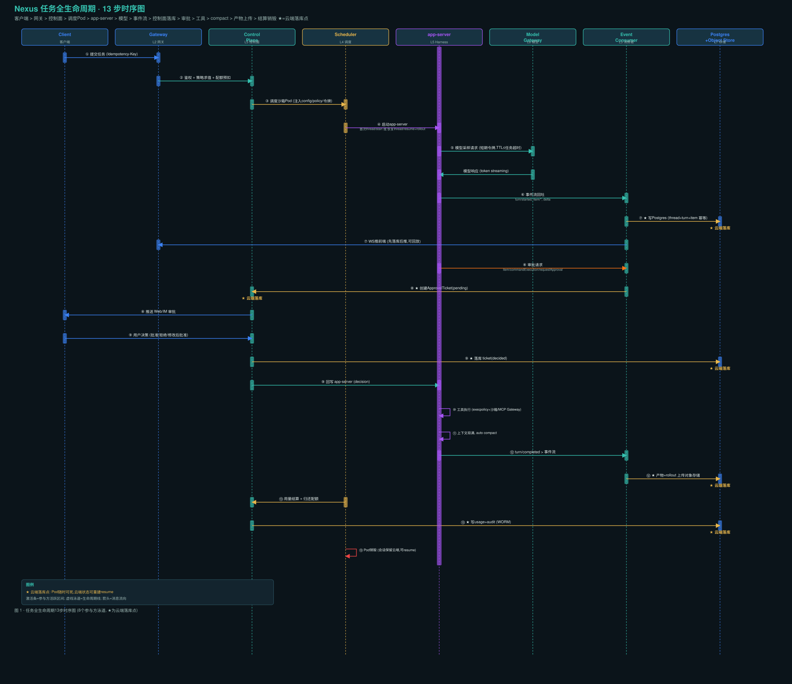
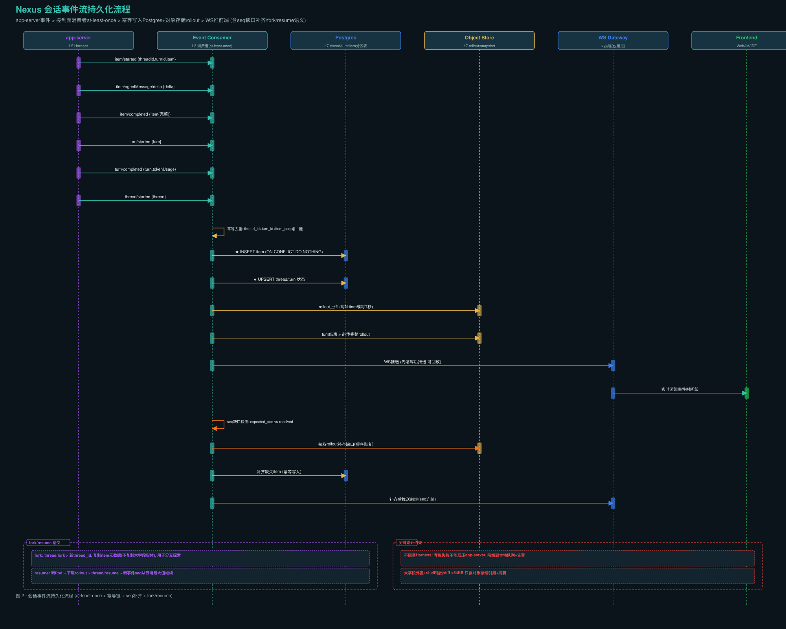
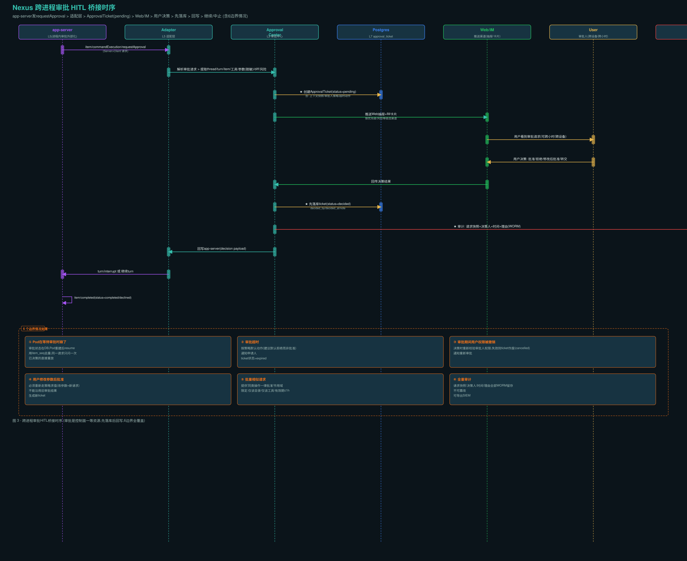
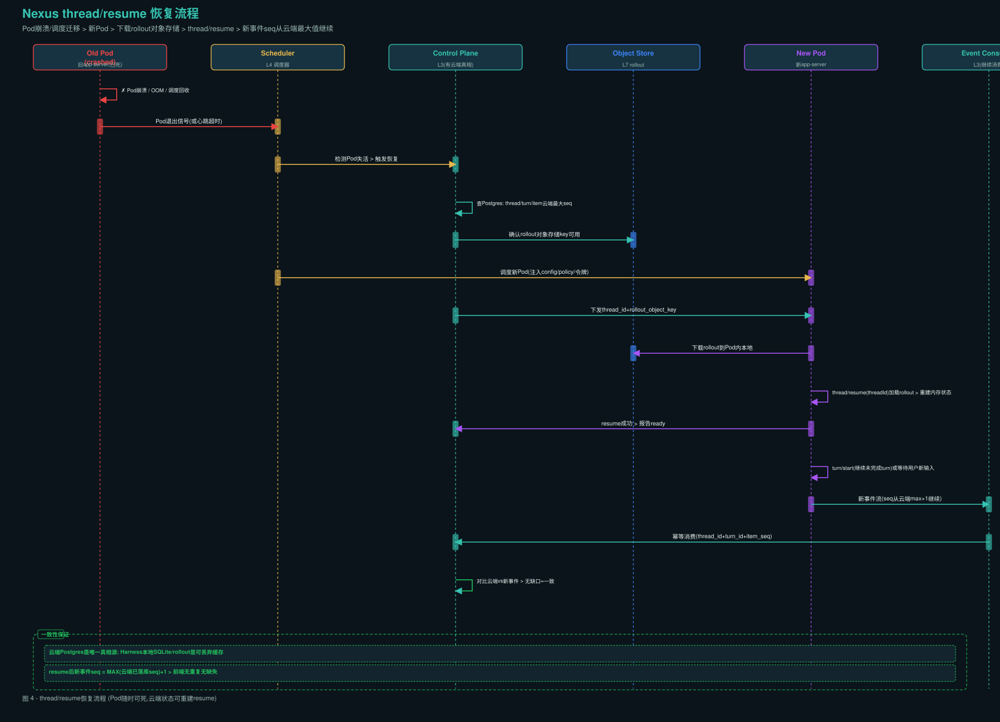
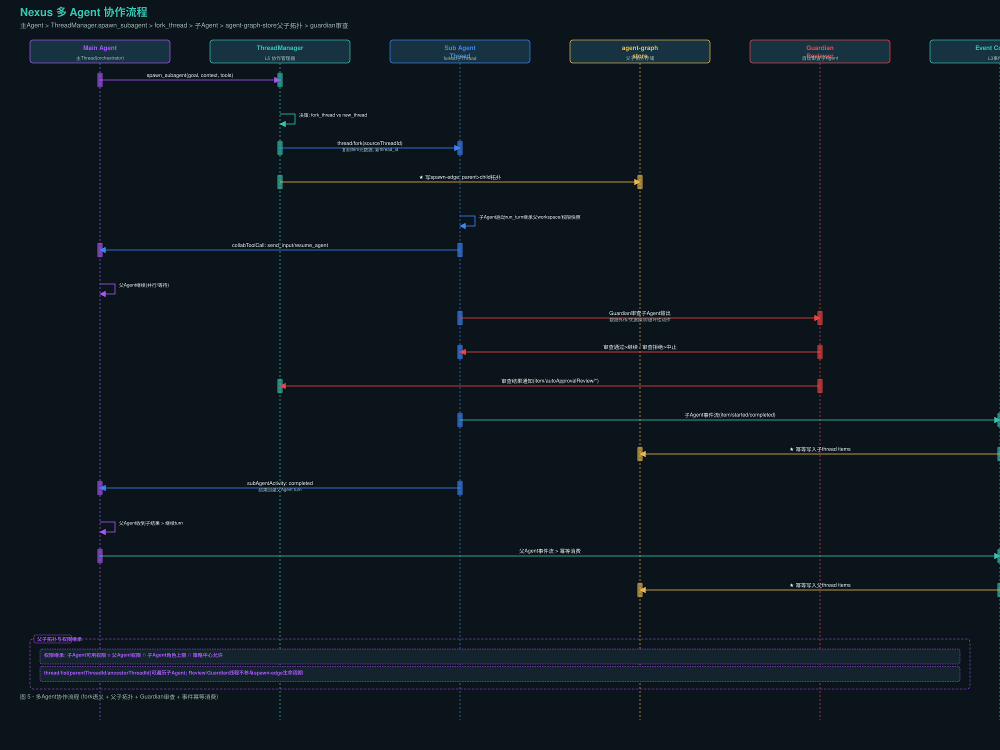
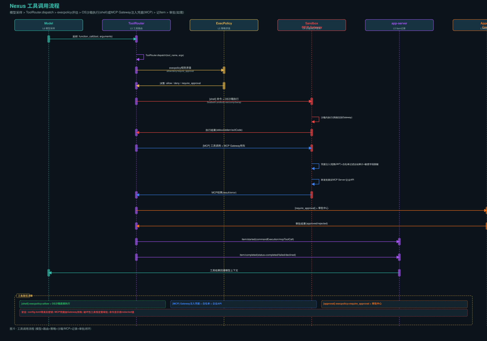
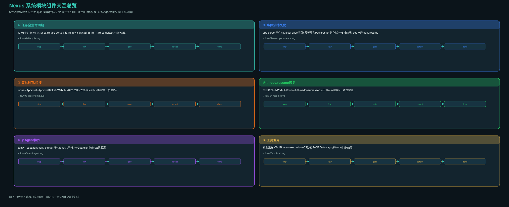

# Nexus 系统模块组件交互流程

> **维度**：04-Interaction Flow / 6 大流程时序图 + 逐步说明
> **基座**：Codex Harness（app-server JSON-RPC 协议）
> **八层对齐**：L1 接入 / L2 网关 / L3 控制面 / L4 执行面 / L5 Harness / L6 模型 / L7 存储 / 安全贯穿
> **图注色板**：★ 金色 = 云端落库点；绿色 = 一致性保证；红色 = 安全/销毁；紫色 = Harness；蓝色 = 网络/存储

---

## 目录

1. [任务全生命周期 13 步时序图](#1-任务全生命周期-13-步时序图)
2. [会话事件流持久化流程](#2-会话事件流持久化流程)
3. [跨进程审批 HITL 桥接时序](#3-跨进程审批-hitl-桥接时序)
4. [thread/resume 恢复流程](#4-threadresume-恢复流程)
5. [多 Agent 协作流程](#5-多-agent-协作流程)
6. [工具调用流程](#6-工具调用流程)
7. [交互流程总览](#7-交互流程总览)

---

## 1. 任务全生命周期 13 步时序图



**参与方泳道**（8 个）：Client → Gateway(L2) → Control Plane(L3) → Scheduler(L4) → app-server(L5) → Model Gateway(L6) → Event Consumer(L3) → Postgres+Object Store(L7)

### 逐步说明

| 步 | 动作 | 参与方 | 关键设计点 |
|---|---|---|---|
| ① | 客户端提交任务 | Client → Gateway | 幂等键 `Idempotency-Key`，避免重复提交产生双份计费 |
| ② | 鉴权 + 策略求值 + 配额预扣 | Gateway → Control Plane | 先扣后跑，防超卖；策略求值结果快照进任务上下文，避免运行中权限漂移 |
| ③ | 调度沙箱 Pod | Control Plane → Scheduler | 注入 `config.toml`、`execpolicy` 规则集、短期令牌；Workspace 由快照/仓库克隆生成 |
| ④ | 启动 app-server，下发 rollout 恢复会话 | Scheduler → app-server | 首次任务用 `thread/start`；恢复任务先下载 rollout 到 Pod 内再 `thread/resume` |
| ⑤ | 模型采样 | app-server → Model Gateway | 沙箱出站只到 Model Gateway，令牌按任务绑定、TTL ≤ 任务超时 |
| ⑥ | app-server 回吐事件流 | app-server → Event Consumer | `turn/started`、`item/*`、`item/agentMessage/delta`、工具进度、审批请求 |
| ⑦★ | 控制面消费事件 → 写云端 Postgres + WS 推前端 | Event Consumer → Postgres/Gateway | 会话持久化的主通道；写库与推送解耦（先落库后推，可回放） |
| ⑧★ | 审批请求 → 落 `ApprovalTicket` → 推送用户 | app-server → Control Plane → Web/IM | 最复杂的一处桥接，见 §3 |
| ⑨★ | 用户决策回写 → app-server 继续 | User → Control Plane → app-server | 决策先落库再回写，宕机可重放 |
| ⑩ | 工具执行 | app-server | shell 走 execpolicy + OS 沙箱；MCP 走 Gateway 注入凭据；两者都记 Item |
| ⑪ | 上下文将满 → auto compact | app-server | 复用 Harness 的压缩能力；压缩前的完整上下文已落云端，可回溯 |
| ⑫★ | turn/completed → 产物与 rollout 上传对象存储 | app-server → Event Consumer → Object Store | 产物扫描（敏感信息/恶意文件）后才对用户可见 |
| ⑬★ | 用量结算 + 审计 → Pod 销毁 | Scheduler → Control Plane → Postgres | 归还配额、写 usage 记录、审计留痕；会话保留在云端可随时 resume |

### ★ 云端落库点汇总

| 落库点 | 写入内容 | 幂等键 | 可回放 |
|---|---|---|---|
| ⑦ | thread / turn / item 事件流 | `thread_id + turn_id + item_seq` | 是，WS 可回放 |
| ⑧ | approval_ticket (pending) | `thread_id + turn_id + item_seq` | 是，Pod 重建后重放 |
| ⑨ | approval_ticket (decided) | `ticket_id` | 是，决策不可丢失 |
| ⑫ | 产物对象 + rollout 完整文件 | `thread_id + turn_id + content_digest` | 是，对象存储永久 |
| ⑬ | usage_record + audit_log | `event_id` (WORM) | 是，审计只追加 |

### 关键约束

- **事件即真相**：所有对用户的可见状态都来自 app-server 事件流；前端不直连 Harness
- **先落库后推送**：写库与推送解耦，写库失败时降级到本地队列并告警，不反压 app-server
- **Pod 随时可死**：任何 Pod 死亡都能从云端状态重建（`thread/resume`）
- **配置即政策**：租户差异表达为下发的 `config.toml` + execpolicy 规则集

---

## 2. 会话事件流持久化流程



**参与方泳道**（6 个）：app-server → Event Consumer → Postgres → Object Store → WS Gateway → Frontend

### 事件类型映射

| app-server 事件 | 控制面动作 | 幂等写入目标 | 大字段处理 |
|---|---|---|---|
| `thread/started` | UPSERT thread 状态 | `thread` 表 | — |
| `turn/started` | UPSERT turn 状态 | `turn` 表 | — |
| `item/started` | INSERT item | `item` 表（分区） | content_ref 指向对象存储 |
| `item/agentMessage/delta` | 累积 delta | 仅推前端，不逐条落库 | — |
| `item/completed` | UPDATE item (final) | `item` 表 | 大字段外置对象存储 |
| `turn/completed` | UPDATE turn (final) + token usage | `turn` 表 | — |
| `item/commandExecution/requestApproval` | 创建 ApprovalTicket | `approval_ticket` 表 | 见 §3 |

### 幂等写入机制

```
唯一键 = (thread_id, turn_id, item_seq)
INSERT INTO item (...) VALUES (...) ON CONFLICT (thread_id, turn_id, item_seq) DO NOTHING
```

- 每个 Item 用 `thread_id + turn_id + item_seq` 作唯一键，重复事件直接丢弃
- 消费者维护期望 seq；出现缺口 → 暂停推送 → 从对象存储拉 rollout 补齐 → 再继续
- 事件流是 at-least-once，"恰好一次"靠幂等键实现

### rollout 上传策略

| 触发条件 | 频率 | 目标 |
|---|---|---|
| 每 N 个 Item | 可配置（默认 50） | 对象存储 `rollouts/{tenant}/{thread}/{turn}.jsonl` |
| 每 T 秒 | 可配置（默认 30s） | 同上 |
| turn 结束 | 必传完整文件 | 同上（最终一致性保证） |

### fork/resume 语义

| 操作 | 语义 | 数据复制 |
|---|---|---|
| `thread/fork` | 产生新 thread_id | 复制 item 元数据（不复制大字段实体），用于"从某步重试/分叉探索" |
| `thread/resume` | 新 Pod → 下载 rollout → 恢复内存状态 | 新事件 seq 从云端最大值继续 |

### 关键设计约束

- **不阻塞 Harness**：写库失败不能反压 app-server（否则 Agent 卡死）；降级到本地队列并告警
- **大字段外置**：shell 输出、diff 超过阈值（64KB）只存对象存储引用 + 摘要
- **WS 仅展示**：前端不作为真相来源，落库是唯一的 truth source

---

## 3. 跨进程审批 HITL 桥接时序



**参与方泳道**（7 个）：app-server → Adapter → Approval Center → Postgres → Web/IM → User → Audit

### 审批请求来源（app-server → Client）

app-server 发出 `item/commandExecution/requestApproval`（Server→Client 请求），包含：
- `threadId`、`turnId`、`itemId` — 定位到具体步骤
- `command`、`cwd`、`commandActions` — 命令展示（redacted 值）
- `reason` — 审批原因
- `kind` — `command`（新命令）或 `writeStdin`（向已有终端写入）

### 审批 Ticket 生命周期

```
pending → (用户决策) → decided(approved/rejected) → archived
                                    ↓
                         expired (超时, 默认拒绝)
                         cancelled (权限撤销)
```

### ApprovalTicket 数据结构

| 字段 | 说明 |
|---|---|
| `thread_id` / `turn_id` / `item_seq` | 定位到具体步骤 |
| `tool_name` / `params_ref` | 工具名 + 参数（脱敏后引用） |
| `diff_preview_ref` | diff 预览（对象存储引用） |
| `risk_level` | low / medium / high / critical |
| `required_approver_role` | 谁可以批 |
| `require_dual` | 是否需双人审批（四眼原则） |
| `context_snapshot_ref` | 审批时上下文快照（事后可回溯） |
| `expires_at` / `default_action` | 超时动作（默认拒绝） |

### 6 个边界情况

| # | 情况 | 处理 |
|---|---|---|
| ① | Pod 在等待审批时崩了 | 审批状态在 DB，Pod 重建后 resume；用 `item_seq` 去重，同一请求只问一次；已决策的直接重放决策 |
| ② | 审批超时 | 按策略默认动作（建议默认**拒绝**而非批准）；通知申请人；ticket 状态 → expired |
| ③ | 审批期间用户权限被撤销 | 决策时重新校验审批人权限，失效则 ticket 作废（cancelled）；通知重新审批 |
| ④ | 用户修改参数后批准 | 必须重新走策略求值（改参数 = 新请求）；不能沿用旧审批结果；生成新 ticket |
| ⑤ | 批量相似请求 | 提供"本次任务内同类操作一律批准"作用域；限定：仅该目录、仅限该工具、有效期 ≤ 1h |
| ⑥ | 全量审计 | 每次审批的请求快照、决策人、时间、理由全部 WORM 留存；不可篡改；可导出 SIEM |

### 关键设计原则

- **审批是控制面一等资源**：不存 Harness 里，先落库再回写
- **先落库后回写**：用户决策先写 `approval_ticket`（status=decided），再回写 app-server
- **审计不可篡改**：每次审批的请求快照 + 决策人 + 时间 + 理由 → WORM 存储

---

## 4. thread/resume 恢复流程



**参与方泳道**（6 个）：Old Pod(crashed) → Scheduler → Control Plane → Object Store → New Pod → Event Consumer

### 恢复流程 14 步

| 步 | 动作 | 关键点 |
|---|---|---|
| 1 | Pod 崩溃（OOM/调度回收） | Harness 本地状态丢失，但云端真相完好 |
| 2 | Pod 退出信号/心跳超时 | Scheduler 检测失活 |
| 3 | 查 Postgres 云端最大 seq | 确定恢复点 |
| 4 | 确认 rollout 对象存储 key | 确保 rollout 可用 |
| 5 | 调度新 Pod | 注入 config/policy/令牌 |
| 6 | 下载 rollout 到 Pod 内 | 从对象存储拉取完整事件历史 |
| 7 | `thread/resume(threadId)` | 加载 rollout → 重建内存状态 |
| 8 | resume 成功 → 报告 ready | 控制面确认恢复 |
| 9 | `turn/start`（继续未完成 turn） | 或等待用户新输入 |
| 10 | 新事件流（seq 从云端 max+1） | 前端无重复无缺失 |
| 11 | 幂等消费（thread_id+turn_id+item_seq） | 重复事件直接丢弃 |
| 12 | 对比云端 vs 新事件 → 无缺口 = 一致 | 一致性验证 |

### 一致性保证

| 保证 | 机制 |
|---|---|
| 唯一真相源 | 云端 Postgres 是唯一 truth source |
| 本地可丢弃 | Harness 本地 SQLite/rollout 是可丢弃缓存 |
| seq 连续性 | resume 后新事件 seq = MAX(云端已落库 seq) + 1 |
| 无重复 | 幂等键 `thread_id + turn_id + item_seq` |
| 无缺失 | seq 缺口检测 + rollout 拉取补齐 |

### app-server thread/resume 协议

```json
{
  "method": "thread/resume",
  "id": 11,
  "params": {
    "threadId": "thr_123",
    "personality": "friendly"
  }
}
```

- 冷 resume 加载配置不持锁，允许无关线程元数据更新并发进行
- 仅一个 app-server 进程可持有分页 thread 的写权限（`-32600` 错误保护）
- `excludeTurns: true` 避免全量历史水合，改用 `thread/turns/list` 分页

---

## 5. 多 Agent 协作流程



**参与方泳道**（6 个）：Main Agent → ThreadManager → Sub Agent(forked) → agent-graph-store → Guardian Reviewer → Event Consumer

### 协作时序 16 步

| 步 | 动作 | 关键点 |
|---|---|---|
| 1 | Main Agent 调用 `spawn_subagent` | 传递 goal/context/tools |
| 2 | ThreadManager 决策 | fork_thread（继承历史）vs new_thread（全新） |
| 3 | `thread/fork(sourceThreadId)` | 复制 item 元数据，新 thread_id |
| 4★ | 写 spawn-edge 拓扑 | parent → child 关系持久化 |
| 5 | 子 Agent 启动 `run_turn` | 继承父 workspace/权限快照 |
| 6 | 子 → 父 `collabToolCall` | send_input / resume_agent |
| 7 | 父 Agent 继续 | 可并行/等待 |
| 8 | Guardian 审查子 Agent 输出 | 数据外传/凭据探测/破坏性动作 |
| 9 | 审查通过 → 继续 / 审查拒绝 → 中止 | Guardian gate |
| 10 | 审查结果通知 | `item/autoApprovalReview/*` |
| 11 | 子 Agent 事件流 | `item/started/completed` |
| 12★ | 幂等写入子 thread items | `thread_id + turn_id + item_seq` |
| 13 | `subAgentActivity: completed` | 结果回灌父 Agent turn |
| 14 | 父 Agent 收到子结果 → 继续 | 子结果作为 `functionCallOutput` 回灌 |
| 15 | 父 Agent 事件流 → 幂等消费 | 同样幂等 |
| 16★ | 幂等写入父 thread items | 同样幂等 |

### 父子拓扑与权限继承

| 维度 | 规则 |
|---|---|
| 拓扑存储 | `agent-graph-store` 维护 spawn-edge（parent → child） |
| 权限继承 | 子 Agent 可用权限 = 父 Agent 权限 ∩ 子 Agent 角色上限 ∩ 策略中心允许 |
| 遍历 | `thread/list(parentThreadId/ancestorThreadId)` 可遍历子 Agent |
| 排除 | Review/Guardian 线程不参与 spawn-edge 生命周期 |

### collabToolCall 类型

| 工具 | 说明 |
|---|---|
| `spawn_agent` | 派生子 Agent |
| `send_input` | 向子 Agent 发送输入 |
| `resume_agent` | 恢复子 Agent |
| `wait` | 等待子 Agent 完成 |
| `close_agent` | 关闭子 Agent |

### Guardian 审查范围

- 数据外传模式检测
- 凭据探测行为检测
- 破坏性动作检测
- 命中关键风险规则 → 转人工
- 低风险操作 → 可自动放行（但全额审计）

---

## 6. 工具调用流程



**参与方泳道**（6 个）：Model → ToolRouter → ExecPolicy → Sandbox/MCP Gateway → app-server(Item) → Approval Center

### 工具调用 16 步

| 步 | 动作 | 关键点 |
|---|---|---|
| 1 | 模型采样 | `function_call(tool, arguments)` |
| 2 | ToolRouter.dispatch | 统一工具路由 |
| 3 | execpolicy 规则求值 | allow / deny / require_approval |
| 4 | 决策返回 | 三条路径分支 |
| 5a | [shell] 命令 → OS 沙箱 | Seatbelt/Landlock+seccomp/bwrap |
| 6a | 沙箱内执行 | 网络仅到 Gateway |
| 7a | 执行结果 | stdout/stderr/exitCode |
| 5b | [MCP] 工具调用 → MCP Gateway 侧车 | 凭据注入 |
| 6b | 凭据注入 + 白名单 + 审计 | 短期 JWT + 出站审计 + 脱敏 |
| 7b | 转发到真实 MCP Server | 企业 API |
| 8b | MCP 结果 | result/error |
| 5c | [approval] → 审批中心 | execpolicy=require_approval |
| 6c | 审批结果 | approved/rejected |
| 7 | item/started | 记录 commandExecution/mcpToolCall/fileChange |
| 8 | item/completed | status=completed/failed/declined |
| 9 | 工具结果回灌模型 | 作为 functionCallOutput 回灌 |

### 三条路径决策

| 路径 | execpolicy 决策 | 执行方式 | 审批 |
|---|---|---|---|
| [shell] | allow | OS 沙箱直接执行 | 不需要 |
| [MCP] | allow | MCP Gateway 注入凭据 → 白名单 → 企业 API | 不需要 |
| [approval] | require_approval | 审批中心 → 用户决策 → 执行/中止 | 必须 |

### 安全约束

| 约束 | 实现 |
|---|---|
| config.toml 零真实密钥 | 只出现指向 Gateway 的本地地址与任务令牌 |
| MCP 凭据由 Gateway 持有 | 短期委托令牌向控制面换取 |
| 破坏性工具恒定需审批 | execpolicy 规则强制 |
| 命令显示用 redacted 值 | `commandActions` 为脱敏展示值 |
| 网络出站仅两个白名单 | Model Gateway + MCP Gateway |

### ThreadItem 类型映射

| Item 类型 | 对应事件 | 说明 |
|---|---|---|
| `commandExecution` | `item/commandExecution/*` | shell 命令执行 |
| `mcpToolCall` | `item/mcpToolCall/*` | MCP 工具调用 |
| `fileChange` | `item/fileChange/*` | 文件编辑 |
| `agentMessage` | `item/agentMessage/delta` | Agent 消息 |
| `reasoning` | `item/reasoning/*` | 推理过程 |
| `contextCompaction` | `item/started/completed` | 上下文压缩 |

---

## 7. 交互流程总览



### 6 大流程关系矩阵

| 流程 | 核心参与方 | 持久化点 | 恢复能力 | 审批介入 |
|---|---|---|---|---|
| ① 生命周期 | 全部 8 层 | 5 个 ★ 点 | Pod 可死可重建 | ⑧⑨ 步 |
| ② 事件持久化 | app-server → L3 → L7 | item 幂等写入 | seq 补齐 + fork/resume | — |
| ③ 审批 HITL | app-server → L3 → User | approval_ticket | Pod 重建后重放 | 全流程核心 |
| ④ resume 恢复 | Scheduler → L3 → L7 → 新Pod | rollout 下载 | seq 从云端 max 继续 | — |
| ⑤ 多 Agent | Main → Sub → graph-store | spawn-edge + items | fork 语义 | Guardian gate |
| ⑥ 工具调用 | Model → ToolRouter → 沙箱/MCP | item 记录 | — | require_approval 路径 |

### 流程间依赖关系

```
①生命周期 ──包含──→ ②事件持久化（⑥⑦步）
    │                ├──包含──→ ③审批HITL（⑧⑨步）
    │                └──包含──→ ④resume恢复（④步恢复）
    │
    ├──包含──→ ⑥工具调用（⑩步）
    │                └──触发──→ ③审批HITL（require_approval路径）
    │
    └──扩展──→ ⑤多Agent协作（子Agent独立生命周期）
                     └──包含──→ ②事件持久化（子thread items）
```

### 设计原则贯穿

| 原则 | 体现 |
|---|---|
| 控制面/执行面分离 | 所有 ★ 落库点在 L3/L7，执行面不持有真相 |
| Harness 不持有企业真相 | 租户/权限/凭据/计费/审计全在控制面 |
| 事件即真相 | app-server 事件流 → 控制面消费 → 落库 → 推前端 |
| 默认最小权限 | 新租户默认只读沙箱 + 全量审批 |
| 可重建优于高可用 | Pod 随时可死，云端状态可重建 resume |
| 配置即政策 | config.toml + execpolicy + MCP 白名单 + AGENTS.md |
