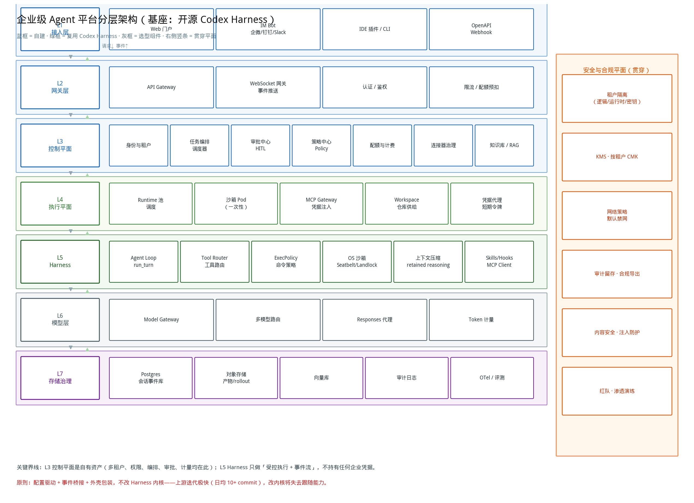
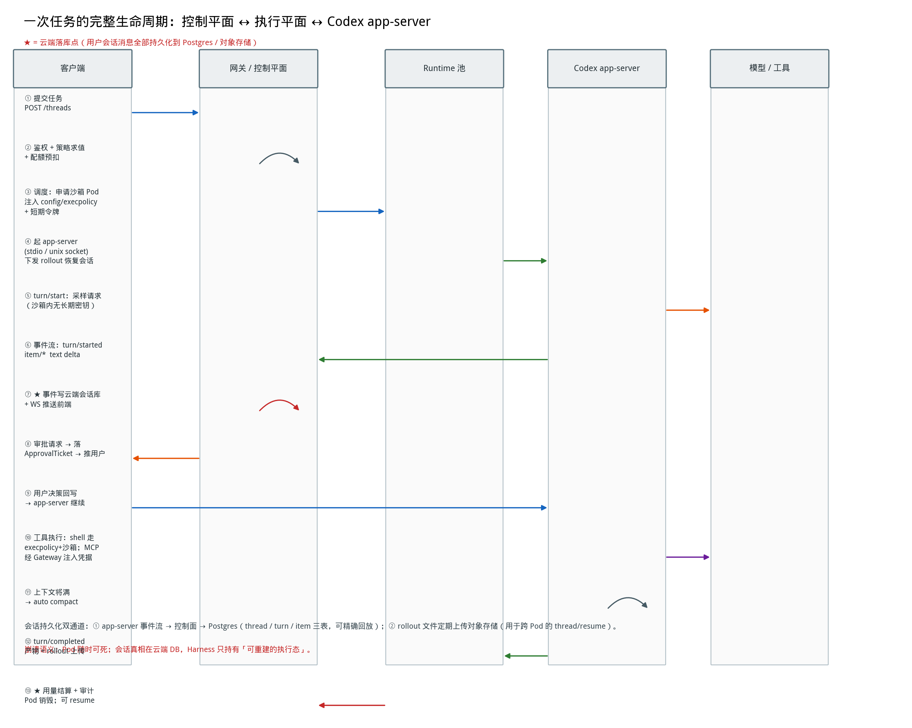

# 基于开源 Codex Harness 的企业级 Agent 平台：系统设计与实施路线图

**信息截止日期：2026 年 9 月 5 日。**关于 Codex 的部分以 `github.com/openai/codex` 仓库与官方 CLI 文档为依据；标注「工程推断/建议」的部分是架构设计选择，不是 OpenAI 公开披露的实现。

---

## 0. 结论先行

### 0.1 一句话架构判断

> **Codex Harness 给你的是「一台单用户、本地、可打断的 Agent 引擎」；你要建的是「让这台引擎变成多租户、可计量、可审计、崩溃不丢会话的企业服务」。前者是执行内核，后者是控制平面——两者必须严格分离，且不要改内核。**

### 0.2 五个决定成败的设计判断

| # | 判断 | 理由 |
|---|---|---|
| 1 | **必须走 `app-server`（JSON-RPC）集成，而不是 `codex exec` 或 SDK** | 只有 app-server 提供长生命周期 Thread、双向事件流、`turn/interrupt`、审批请求回写、`thread/resume`。企业级平台的会话持久化、人机审批、断线重连全靠这四个能力。`codex exec` 是一次性进程，SDK 是进程内编排——都扛不住"Pod 随时会死、审批要等人几小时"的企业场景。[citation:6][citation:9] |
| 2 | **会话真相在云端 DB，Harness 只持有"可重建的执行态"** | Codex 自身的持久化是本地 SQLite（`state` / `thread-store`）加本地 rollout 文件[citation:12][citation:13]。这是单机假设。企业平台的做法是：app-server 的**事件流**由控制面消费后写入云端 Postgres，rollout 文件同步到对象存储；Pod 销毁不丢会话，`thread/resume` 时下发 rollout 到新 Pod。 |
| 3 | **沙箱内零长期密钥** | 沙箱 Pod 拿到的必须是短期、按任务绑定、可撤销的令牌。模型调用经自建 Model Gateway（或复用 `responses-api-proxy`、`model-provider` 抽象指向自有端点），MCP 凭据由 MCP Gateway 侧车注入，绝不写进 `config.toml`。[citation:7][citation:8] |
| 4 | **权限分三层，execpolicy 是天然的政策下发载体** | 平台身份（谁在用）→ 工作区/环境（能碰哪些仓库与数据）→ 工具与命令（能跑什么 shell、调什么 MCP）。Codex 的 `execpolicy` 规则引擎 + `approval_policy` + `sandbox.mode` 恰好承接第三层，可按租户/角色动态生成配置下发。[citation:2][citation:7] |
| 5 | **不改 Harness 内核** | 上游日均 10+ commit、140+ crate[citation:10]，任何内核改动都会在数周内变成合并地狱。原则是"配置驱动 + 事件桥接 + 外壳包装"；确需 patch 的放入 `patches/` 目录并做上游对齐看板。 |

### 0.3 需要立刻纠正的三个常见误解

- **误解：Codex 开源了模型。** 没有。开源的是 Harness（执行框架）与三层集成接口，GPT-5.x 模型仍只能通过 API / ChatGPT 订阅访问；如需私有部署，走 `ollama` / `lmstudio` provider 接开源权重模型，但能力会下降。[citation:9]
- **误解：Codex 的沙箱可以直接当多租户隔离用。** 不行。Seatbelt / Landlock+seccomp / Windows restricted token 是**单租户内的命令级隔离**，防的是 Agent 乱跑命令；租户之间的隔离必须靠控制平面的命名空间、网络策略、按租户密钥和存储前缀来做。[citation:2][citation:8]
- **误解：Codex 的审批机制能直接搬到 Web。** 不行。它的审批是本地 TUI 弹窗、进程内阻塞等待。企业场景要的是"审批持久化到 DB、人在手机/IM 上几小时后点批准、期间 Pod 可以重建"，这个桥接层必须自建。

---

## 1. 基座盘点：Codex Harness 给了什么，缺什么

### 1.1 可复用资产清单（这些不要自己写）

Codex 仓库是 Cargo 工作区，140+ crate，Apache-2.0，Rust（2024 edition，Tokio 异步运行时）[citation:1][citation:10]。

| 能力域 | 对应 crate / 模块 | 你能直接拿到什么 | 复用方式 |
|---|---|---|---|
| Agent 主循环 | `core`（`run_turn`） | 一次 Turn 的七个阶段：准入 → 快照 → 采样 → 工具调度 → 结果写回 → 压缩判定 → 完成/中断 | 黑盒调用，不改动 |
| 上下文工程 | `core` 的 compact 逻辑 | 自动上下文压缩（`run_auto_compact`）、推理轨迹保留（retained reasoning） | 通过配置开关与阈值调优 |
| 工具路由 | `tools` / `core` 的 ToolRouter | 统一工具定义（JSON Schema）、MCP 工具适配、动态工具解析、四层调用形态 | 扩展自有工具走 Tool Manifest + MCP |
| 执行策略 | `execpolicy` | 规则化的命令 allow/deny 评估引擎（parser + evaluator + rule types，与会话层解耦） | **按租户下发规则集** |
| OS 沙箱 | `sandboxing`、`linux-sandbox`、`windows-sandbox-rs` | macOS Seatbelt（sandbox-exec + .sbpl）、Linux Landlock + seccomp + bubblewrap、Windows restricted token | 直接用，但需容器层兜底 |
| 审批 | `core` approval_policy | `untrusted` / `on-failure` / `on-request` / `never` 四档；与 sandbox 模式正交配置 | 外部桥接（见 §4.3） |
| MCP | `codex-mcp`（客户端）、`mcp-server`（服务端） | 连外部 MCP 服务器；也把 Codex 自身暴露成 MCP 工具给别的 Agent 调 | 经 MCP Gateway 代理 |
| Skills / Hooks | `skills`、`hooks` | 可复用的 Markdown 程序化技能；生命周期钩子 | 企业 Skill 市场的基础 |
| 会话持久化 | `state`（SQLite）、`thread-store`、`rollout` | Thread 跨进程重启可恢复、可 fork、可回滚 | **改造点**：事件外送到云端 |
| 集成接口 | `app-server`、`app-server-protocol`、`sdk/{typescript,python}`、`exec` | JSON-RPC 2.0（stdio / unix socket / WebSocket）；Thread→Turn→Item 三原语；`generate-ts` / `generate-json-schema` 生成类型 | **主集成面** |
| 模型抽象 | `model-provider-info`、`responses-api-proxy`、`ollama`、`lmstudio` | 指向任意 OpenAI 兼容端点，支持本地模型 | 接自有 Model Gateway |
| 多 Agent | `collaboration-mode-templates`、sub-agent | 子 Agent 派生、协作模板 | 团队 Agent 编排参考 |

**Thread / Turn / Item / Session 的边界**（务必分清，否则数据模型会设计错）[citation:12]：

- **Thread**：app-server 协议层对外的长期会话对象，可 `fork` / `resume` / `archive` / 回滚。
- **Session**：Core 内部真正持有活动状态、输入队列、历史的运行时对象（**不对外暴露**）。
- **Turn**：一次任务往返（用户消息 → 模型推理 → 工具调用 → 结果回灌，可能经历多次采样）。
- **Step**：Turn 内的一次模型采样快照（每次采样的工具可见性与上下文都可能不同）。
- **Item**：Turn 内可持久化的原子事实——用户消息、推理、shell 命令、文件编辑、工具结果。

> 类比：Thread 像项目文件夹，Turn 像一张工单，Step 像一次思考，Item 像工单日志流水。

### 1.2 缺口清单（这些必须自建）

| 缺口 | 说明 | 严重度 |
|---|---|---|
| 租户 / 组织 / 用户体系 | Codex 只有本机登录（ChatGPT 账号或 API Key），无组织概念 | 致命 |
| 角色与资源授权 | 无 RBAC / ABAC，无资源级授权 | 致命 |
| 云端会话存储 | 本地 SQLite + 本地 rollout 文件，无多副本、无跨机恢复 | 致命 |
| 远程运行时池 | 假设"Agent 跑在我本机"，无调度、无队列、无并发配额 | 致命 |
| 持久化审批流 | 审批是进程内阻塞弹窗，不能跨小时、不能跨设备、不能审计 | 高 |
| 配额 / 计费 / 成本归因 | 无租户级预算、无限流、无成本分摊 | 高 |
| Web / IM 入口与实时推送 | 只有 TUI 与 IDE | 高 |
| 审计与合规导出 | 无集中审计、无 SIEM 对接 | 高 |
| 知识库 / RAG | 只有仓库文件与 AGENTS.md，无企业知识检索与 ACL 过滤 | 中（可后补） |
| 企业连接器治理 | MCP 配置是本地 TOML，凭据明文写在配置文件里 | 高 |

### 1.3 三条集成路径的选型（重要）

| 维度 | `codex exec` | Codex SDK（TS/Python） | **app-server（JSON-RPC）** |
|---|---|---|---|
| 进程模型 | 一次性，跑完退出 | 嵌入式，宿主进程内 | 独立长驻进程，跨机可连 |
| 持久会话 | 无 | 有（thread） | 有（thread/fork/resume） |
| 事件流 | JSONL 事后 | 流式 | **双向持续事件流** |
| 中断 | 不支持 | 支持 | **支持 `turn/interrupt`** |
| 审批交互 | 无 | 回调 | **协议级审批请求/回写** |
| 崩溃恢复 | 无 | 宿主死了就没了 | **Pod 可重建 + resume** |
| 适合 | CI、批量脚本 | 单租户产品快速起步 | **多租户企业平台** |

**结论：以 app-server 为主集成面，SDK 仅用于内部工具与批处理，exec 用于 CI 场景。**[citation:3][citation:6][citation:9]

---

## 2. 总体架构

### 2.1 六条设计原则

1. **控制平面 / 执行平面分离**：控制面是长期有状态、多租户、强一致的服务；执行面是无状态、一次性、可被随时销毁的沙箱。两者只通过 app-server 协议与对象存储通信。
2. **Harness 不持有企业真相**：租户、权限、凭据、计费、审计全在控制面；沙箱里只有"本次任务的短期令牌 + 最小工作集"。
3. **事件即事实**：所有对用户的可见状态都来自 app-server 事件流；前端不直连 Harness，避免绕过审计。
4. **默认最小权限**：新租户默认只读沙箱 + 全量审批；权限只能显式提升，不能默认放宽。
5. **可重建优于高可用**：不为沙箱 Pod 做复杂的高可用，而是让"任何 Pod 死亡都能从云端状态重建"——这比保活更便宜也更安全。
6. **配置即政策**：租户差异尽量表达为下发给 Harness 的 `config.toml` + execpolicy 规则集，而不是代码分支。

### 2.2 分层架构总览


*图 1：八层架构。L1–L3 与 L6–L7 自建，L4 是自建外壳，L5 复用 Codex Harness。*

| 层 | 职责 | 关键模块 | 是否复用 Codex |
|---|---|---|---|
| L1 接入层 | 多渠道统一入口 | Web 门户、IM Bot、IDE 插件、OpenAPI、Webhook | 否（可复用其 IDE 扩展协议） |
| L2 网关层 | 南北向流量、鉴权、实时推送 | API Gateway、WebSocket 网关、认证中间件、限流 | 否 |
| L3 控制平面 | **平台的大脑与账本** | 身份租户、任务编排、审批中心、策略中心、配额计费、连接器治理、知识库 | 否 |
| L4 执行平面 | **Harness 的托管外壳** | Runtime 池调度、沙箱 Pod、MCP Gateway、Workspace 供给、凭据代理 | 薄壳 + 复用 |
| L5 Harness | Agent 执行内核 | Agent Loop、Tool Router、ExecPolicy、OS 沙箱、上下文压缩、Skills/Hooks | **是（黑盒）** |
| L6 模型层 | 模型访问与计量 | Model Gateway、多模型路由、Responses 代理、Token 计量 | 部分（`model-provider`、`responses-api-proxy`） |
| L7 存储与治理 | 持久化与可观测 | Postgres 会话库、对象存储、向量库、审计日志、OTel、评测 | 否 |
| 贯穿 | 安全与合规 | 租户隔离、KMS、网络策略、审计留存、内容安全、红队 | 否 |

### 2.3 控制平面 / 执行平面的物理切分

这是整个架构里**最关键的一条线**：

```
┌─────────────── 控制平面（长期有状态 · 多租户 · 强一致）───────────────┐
│  API / WS 网关  │  任务编排器  │  审批中心  │  策略中心  │  计量  │  知识库  │
│  Postgres（tenant/user/thread/turn/item/approval/usage/audit）        │
│  对象存储（artifacts / rollouts / snapshots）                          │
└───────────────────────────┬──────────────────────────────────────────┘
                            │ ① 调度指令（K8s Job / Queue）
                            │ ② app-server JSON-RPC（经 exec / port-forward / unix socket）
                            │ ③ 事件流回传
┌───────────────────────────▼──────────────────────────────────────────┐
│  执行平面（一次性 · 单租户单任务 · 无状态 · 可销毁）                    │
│  ┌──────────── Sandbox Pod（NetworkPolicy: 默认全禁）────────────────┐ │
│  │  codex app-server  ←── config.toml + execpolicy（运行时注入）      │ │
│  │  Workspace（git worktree / PVC 快照）                              │ │
│  │  MCP Gateway sidecar（凭据注入 · 工具白名单 · 出站代理）           │ │
│  │  出站：仅 Model Gateway 与 MCP Gateway 两个白名单地址              │ │
│  └───────────────────────────────────────────────────────────────────┘ │
└──────────────────────────────────────────────────────────────────────┘
```

**为什么必须这样切：**

- 沙箱一定会跑不受信代码（依赖安装、用户脚本、MCP 子进程的 stdio 命令）——把它放进控制平面等于把整个平台暴露出去。[citation:8]
- 沙箱的生命周期是分钟到小时级，控制平面是年计；混在一起会让发布、灰度、灾备全部复杂化。
- 只有物理隔离，才能对"租户 A 的 Agent 拿到租户 B 的数据"这类问题给出可验证的答案（网络策略 + 独立密钥 + 独立存储前缀，三重取证）。

### 2.4 一次任务的完整生命周期


*图 2：13 步主流程，★ 为云端落库点。*

逐步说明：

| 步 | 动作 | 关键设计点 |
|---|---|---|
| ① | 客户端提交任务 | 幂等键 `Idempotency-Key`，避免重复提交产生双份计费 |
| ② | 鉴权 + 策略求值 + 配额预扣 | 先扣后跑，防超卖；策略求值结果快照进任务上下文（避免运行中权限漂移） |
| ③ | 调度沙箱 Pod | 注入 `config.toml`、`execpolicy` 规则集、短期令牌；Workspace 由快照/仓库克隆生成 |
| ④ | 启动 app-server，下发 rollout 恢复会话 | 首次任务用 `thread/start`；恢复任务先下载 rollout 到 Pod 内再 `thread/resume` |
| ⑤ | 模型采样 | 沙箱出站只到 Model Gateway，令牌按任务绑定、TTL ≤ 任务超时 |
| ⑥ | app-server 回吐事件流 | `turn/started`、`item/*`、`text delta`、工具进度、审批请求 |
| ⑦ | **控制面消费事件 → 写云端 Postgres + WS 推前端** | 这是会话持久化的主通道；写库与推送解耦（先落库后推，可回放） |
| ⑧ | 审批请求 → 落 `ApprovalTicket` → 推送用户 | 见 §4.3，这是最复杂的一处桥接 |
| ⑨ | 用户决策回写 → app-server 继续 | 决策先落库再回写，宕机可重放 |
| ⑩ | 工具执行 | shell 走 execpolicy + OS 沙箱；MCP 走 Gateway 注入凭据；两者都记 Item |
| ⑪ | 上下文将满 → auto compact | 复用 Harness 的压缩能力；压缩前的完整上下文已落云端，可回溯 |
| ⑫ | `turn/completed` → 产物与 rollout 上传对象存储 | 产物扫描（敏感信息 / 恶意文件）后才对用户可见 |
| ⑬ | 用量结算 + 审计 → Pod 销毁 | 归还配额、写 usage 记录、审计留痕；会话保留在云端可随时 resume |

---

## 3. 分层详细设计

### 3.1 L1 接入层

| 入口 | 形态 | 要点 |
|---|---|---|
| Web 门户 | React + WebSocket | 会话列表、任务时间线（Item 流）、审批抽屉、产物预览、Diff 查看 |
| IM Bot | 企业微信 / 钉钉 / 飞书 / Slack | 审批推送的最佳渠道；用卡片消息承载"批准/拒绝/修改后批准" |
| IDE 插件 | VS Code / JetBrains | 可直接复用 Codex 已有的 app-server 协议与 IDE 扩展思路[citation:6]，把远端 Thread 映射到本地 |
| OpenAPI | REST + Webhook | 让 Agent 能力被业务系统调用；Webhook 用于任务完成回调 |
| CLI | 复用 `codex` + 自定义登录 | 开发者体验最优入口 |

**统一约束：所有入口都不直连 Harness。** 都必须经过 L2 网关，否则审计链路断裂。

### 3.2 L2 网关层

- **API Gateway**：REST 路由、请求校验、幂等、限流（租户级 + 用户级 + IP 级）。
- **WebSocket 网关**：会话事件推送；订阅关系是"用户对 Thread 的读权限"驱动，权限变更立即断连。
- **认证中间件**：OIDC / SAML 对接企业 IdP；SCIM 同步组织架构；服务账号用 mTLS。
- **配额预扣**：在网关层做粗粒度拦截，细粒度结算在 L3。

### 3.3 L3 控制平面（自建核心）

#### 3.3.1 身份与租户

```
Tenant（租户）
  └── OrgUnit（组织单元，可多级，映射企业部门树）
        └── User / ServiceAccount
              └── Role（角色：owner / admin / developer / auditor / viewer）
  └── Workspace（工作环境：绑定仓库、数据集、连接器、知识库范围）
        └── Membership（成员 × 角色 × 资源作用域）
```

- **授权模型**：RBAC 打底 + ABAC 兜底。ABAC 属性取 `tenant_id`、`org_path`、`env(prod/staging)`、`data_classification`、`risk_level`、`time_window`。
- **三个必须区分的身份**：
  1. **用户身份**（人在用）
  2. **Agent 身份**（服务账号，**不等于**用户身份，权限是用户权限的**子集**且需显式授予）
  3. **连接器身份**（MCP/OAuth 委托令牌，按租户隔离存储）
- **权限继承规则**：Agent 可用权限 = `用户权限 ∩ 工作区权限 ∩ Agent 角色上限 ∩ 策略中心允许`。四者取交集，任何一项为空即拒绝。

#### 3.3.2 任务编排与调度

- **不要自己写 while-loop 编排器。** 用持久化工作流引擎（Temporal / Cadence），把"申请 Pod → 建连 → 下发任务 → 消费事件 → 处理审批 → 收尾结算"建模为一个可恢复的 Workflow。理由：审批可能等几小时、Pod 会崩、网络会断——只有持久化工作流能天然表达"等三天再继续"。
- **两个循环层次**：
  - **外层（平台）Workflow**：管资源与账本（Pod 生命周期、配额、审计），长周期。
  - **内层（Harness）run_turn**：管模型与工具，短周期。两者通过事件流关联，不要混成一个循环。
- **调度策略**：按租户权重队列 + 优先级 + 并发上限；Prod 任务与实验任务分池，避免互相饿死。

#### 3.3.3 审批中心（HITL）

见 §4.3，是重灾区，单独展开。

#### 3.3.4 策略中心

- **策略对象**：`{tenant, org_path, role, workspace, tool, action, risk_level, data_classification}`。
- **决策结果**：`allow` / `deny` / `require_approval` / `require_dual_approval`（四眼原则）/ `allow_with_audit_only`。
- **策略求值时机**：任务准入一次、**每次高危工具调用前一次**（不要把准入结果当永久通行证）。
- **漂移防护**：策略快照写入任务上下文，运行中策略变更按"不溯及已批准动作、对新动作用新策略"处理。

#### 3.3.5 配额与计费

- **四维计量**：token（区分 prompt/cached/reasoning/output）、工具调用次数、沙箱运行时长、存储与出站流量。
- **归因维度**：`tenant → org_unit → user → thread → turn → model`，必须能回答"某部门上周在模型上花了多少钱"。
- **预算控制**：软阈值告警 → 降档到经济模型 → 硬阈值熔断。熔断时正在跑的任务**优雅暂停**（保存 rollout）而非直接杀，以便预算追加后 resume。

#### 3.3.6 连接器治理

- **分类分级**：官方认证连接器 / 企业私有连接器 / 社区连接器（默认禁用，需管理员显式开启）。
- **每个连接器必备元数据**：owner、权限粒度、幂等性、副作用等级、限流、版本、评测覆盖度、最后健康检查时间。
- **质量分**：可用性、P95 延迟、错误率、权限最小化程度 → 低于阈值自动降级或下线。
- **安全**：MCP stdio 型服务器是重大风险面（配置即代码执行）。必须强制：项目级 `.codex/config.toml` 只在受信任工作区生效、MCP 工具 `enabled_tools` 白名单优先于 `disabled_tools`、破坏性注解工具恒定需审批。[citation:8]

#### 3.3.7 知识库 / RAG

- **ACL 必须随索引写入**：每个 chunk 携带 `tenant_id + acl_tags + permission_version`；检索时先过滤后召回，绝不先召回后过滤。
- **检索流程**：metadata/ACL 过滤 → 稠密 + 稀疏混合召回 → rerank → 只回填支撑结论的片段（附 chunk_id 与权限版本，供审计）。
- **与 Harness 的衔接**：知识检索做成 MCP 工具或自定义 Tool，让 Harness 像调其他工具一样调用；检索权限在 Gateway 侧强制，不依赖模型"自觉遵守"。

### 3.4 L4 执行平面（Harness 托管外壳）

#### 3.4.1 Runtime 池调度

| 项 | 设计 |
|---|---|
| 任务粒度 | 一个 Turn = 一个 Pod（长任务可复用，但有最大时长，超期强制结算并 resume 到新 Pod） |
| 镜像 | 预装 Codex 二进制 + 语言工具链的基础镜像；按语言/场景分多个镜像，避免巨型镜像 |
| 冷启动优化 | 预热池（warm pool）+ Workspace 快照（PVC snapshot / stash）；目标冷启动 < 5s |
| 并发 | 租户级并发上限 + 全局上限 + 队列等待位；超限进入排队并实时告知用户位置 |
| 销毁 | 任务结束或空闲超时（建议 15–30 min）后销毁；销毁前必做：上传 rollout、结算、审计 |

#### 3.4.2 沙箱设计（三层，缺一不可）

Codex 提供了**第二层**（命令级 OS 沙箱）[citation:2][citation:8]，你要补第一层和第三层：

| 层 | 技术 | 防什么 |
|---|---|---|
| ① 容器/微虚拟机层 | K8s Pod + 受限 Seccomp/AppArmor；高敏租户用 Kata / Firecracker | 租户间横向逃逸、内核攻击面 |
| ② 命令级 OS 沙箱（Codex 自带） | macOS Seatbelt；Linux Landlock + seccomp + bubblewrap；Windows restricted token | Agent 在本工作区内乱跑命令、读 SSH key、外传数据 |
| ③ 网络层 | NetworkPolicy 默认拒绝全部出站，仅放行 Model Gateway 与 MCP Gateway | 数据外泄、C2 回连、依赖投毒外联 |

> **注意**：Linux 下 Codex 沙箱在容器中可能因宿主不支持 Landlock/seccomp 而失效[citation:2]。因此**容器层不能省**，且需在启动自检里验证沙箱可用性（自检失败 = 该节点不允许调度生产任务）。

**sandbox 与 approval 的正交配置**（沿用 Codex 默认哲学）[citation:2]：

| 场景 | `sandbox.mode` | `approval_policy` | 说明 |
|---|---|---|---|
| 新租户默认 | `read-only` | `untrusted` | 只读 + 逐条确认，最保守 |
| 成熟场景 | `workspace-write` | `on-failure` | 工作区内可写，失败才问 |
| 高危场景 | `read-only` | `always` | 强管控，任何动作都要人批 |
| 禁止场景 | — | — | `danger-full-access` 在企业平台**不向终端用户开放**，仅受控的内部任务可在审计下使用 |

#### 3.4.3 Workspace 供给

- **代码场景**：从 Git 仓库 shallow clone 或挂载 PVC 快照；建议用类似 git worktree 的思路做并行任务隔离，避免多任务改同一份文件[citation:11]。
- **非代码场景**：挂载租户对象存储前缀下工作目录（只读 + 可写 scratch 分区）。
- **AGENTS.md 注入**：把企业规范、项目约定、安全红线写成 AGENTS.md 随 Workspace 下发——这是最廉价的"企业规则下达"手段。

#### 3.4.4 MCP Gateway（凭据注入的关键）

```
Codex (MCP Client)
   │  stdio / http
   ▼
MCP Gateway Sidecar（同 Pod，但独立凭据域）
   ├─ 从控制面换取短期凭据（TTL ≤ 任务时长）
   ├─ 强制 enabled_tools 白名单
   ├─ 出站请求审计 + 敏感字段脱敏
   └─ 转发到真实 MCP Server / 企业 API
```

**要点**：Codex 的 `config.toml` 里**不出现任何真实密钥**，只出现指向 Gateway 的本地地址与任务令牌。

#### 3.4.5 凭据代理

- 签发短期令牌（JWT， audience 限定为 Model Gateway / MCP Gateway，TTL = 任务超时 + 缓冲）。
- 令牌绑定 `tenant_id + thread_id + turn_id + 权限快照哈希`，任一不符即拒绝。
- 支持即时吊销（用户点"停止任务" → 控制面吊销 → Gateway 拒绝后续调用）。

### 3.5 L5 Harness 适配层（你唯一需要"贴着 Codex 写"的代码）

这一层是**薄适配**，职责严格限定为四件事：

1. **协议桥接**：把 app-server 的 JSON-RPC 事件流 → 内部事件总线（Kafka / NATS / Postgres LISTEN/NOTIFY）。
   - 用 `codex app-server generate-json-schema` / `generate-ts` 生成类型定义并纳入 CI，协议变更可自动检出[citation:6]。
2. **配置生成**：按 `tenant + role + workspace + risk_level` 生成 `config.toml`、execpolicy 规则集、MCP 声明、Skills 清单，运行时注入 Pod。
3. **命令包装**：对外暴露 `start` / `resume` / `interrupt` / `approve` / `fork` / `archive` 六个动作，映射到底层协议。
4. **健康检查与回收**：探测 app-server 存活、处理僵尸进程、Pod 退出前上传 rollout。

**明确不做**：不改 `run_turn`、不改工具路由、不改压缩算法、不改 execpolicy 求值器。这些是上游的高价值区，也是高变动区。

### 3.6 L6 模型层

- **统一入口**：所有模型调用经 Model Gateway（可用 LiteLLM / 自建；Codex 侧也可复用 `responses-api-proxy` 与 `model-provider` 抽象指向自有端点）[citation:7]。
- **路由策略**：按任务复杂度分档——分类/抽取/简单问答走经济模型，规划/复杂工具编排走强模型，长任务中段可用中档。参考阿里百炼 AUTO 路由思路，但**必须在自有评测集上校准**，不能照搬。
- **缓存**：相同前缀启用 prompt caching；系统提示与工具描述做版本化，提升命中率。
- **故障转移**：主模型超时/限流 → 降级到备模型 → 仍失败则任务进入"待重试"而非直接失败。
- **私有化**：有数据不出域要求的租户，指向自建 vLLM / Ollama 端点（Codex 内置 ollama / lmstudio provider）[citation:7][citation:9]。

### 3.7 L7 存储与治理

存储分层：

| 数据类型 | 存储 | 理由 |
|---|---|---|
| 结构化元数据（租户/用户/权限/任务） | Postgres | 强一致、事务 |
| 会话事件（Item 流） | Postgres（分区表）+ 冷归档到对象存储 | 需实时查询与回放；量大按月分区 |
| rollout / 快照 | 对象存储（按租户前缀 + 按租户 CMK 加密） | 大对象、低频访问 |
| 产物（文档/代码/报告） | 对象存储 + 病毒/敏感扫描 | 需分享与版本 |
| 知识库向量 | pgvector / Milvus / 托管向量库 | 视既有栈 |
| 审计日志 | 追加写存储（WORM）+ SIEM 投递 | 合规要求不可篡改 |
| 追踪与指标 | OTel → ClickHouse / ES + Grafana | 可观测 |

---

## 4. 六个硬骨头专题

### 4.1 会话云端持久化：三写一致与 resume 语义

**问题**：Codex 自己往本地 SQLite 和 rollout 文件写[citation:12][citation:13]；你要云端也有一份。两边不一致怎么办？

**方案：以控制面写入为准，Harness 本地状态视为"可丢弃缓存"。**

```
app-server 事件流
   ├─→ 控制面消费者（at-least-once）
   │      ├─ 幂等写入（event_id 唯一键）
   │      ├─ 顺序补齐（seq 缺口时主动拉取 rollout 补齐）
   │      └─ 写 Postgres：thread / turn / item
   ├─→ 对象存储：rollout 文件（每 N 个 Item 或每 T 秒上传一次，结束时必传）
   └─→ WebSocket：推前端（仅展示，不作为真相）
```

**关键设计点：**

| 点 | 做法 |
|---|---|
| 幂等 | 每个 Item 用 `thread_id + turn_id + item_seq` 作唯一键，重复事件直接丢弃 |
| 顺序 | 消费者维护期望 seq；出现缺口 → 暂停推送、从对象存储拉 rollout 补齐、再继续 |
| 不阻塞 Harness | 写库失败不能反压 app-server（否则 Agent 卡死）；落盘失败时降级到本地队列并告警 |
| 大字段 | shell 输出、diff 超过阈值（如 64KB）只存对象存储引用 + 摘要，避免拖垮 Postgres |
| resume 语义 | 新 Pod → 下载 rollout → `thread/resume`；恢复后新事件 seq 从云端最大值继续 |
| fork 语义 | `thread/fork` 产生新 thread_id，复制 item 元数据（不复制大字段实体），用于"从某步重试/分叉探索" |
| 权限变更 | 用户失去某 Thread 的读权限 → 前端立即断开 WS；已落库数据按租户密钥加密，权限撤销后无法解密（需 KMS 支持按租户 CMK 禁用） |

**必须接受的现实**：事件流是 at-least-once，"恰好一次"要靠幂等键实现，不要指望上游保证。

### 4.2 权限模型：三层授权

```
第一层  平台身份层     用户 / 服务账号 / Agent 身份，SSO + SCIM + RBAC/ABAC
              ↓（决定"能不能进这个工作区"）
第二层  工作区层       仓库、数据集、连接器、知识库范围；环境标签（prod/staging）
              ↓（决定"这个环境里能碰什么"）
第三层  工具与命令层   execpolicy 规则 + approval_policy + MCP 工具白名单 + sandbox.mode
              ↓（决定"具体能执行什么动作"）
          执行，并全量记录
```

**第三层的政策下发**（这是复用 Codex 最巧妙的地方）：

```
控制面按 (tenant, role, workspace, risk_level) 生成：
  ├── config.toml         # sandbox.mode / approval_policy / mcp_servers / model_provider
  ├── execpolicy.rules    # 命令 allow/deny 规则集（Codex execpolicy 规则语言）
  ├── enabled_tools       # 每个 MCP server 的工具白名单
  └── AGENTS.md           # 项目级自然语言规范（兜底的软约束）
        ↓ 运行时注入 Pod，任务结束即焚
```

**四层交集规则**（重申）：
`Agent 可用权限 = 用户权限 ∩ 工作区权限 ∩ Agent 角色上限 ∩ 策略中心允许`

**典型错误**：把 Agent 身份等同于用户身份。用户能看到的东西远多于他愿意让 Agent 自动操作的东西——**读权限可以给全，写权限必须单独授予**。

### 4.3 审批流：跨进程 HITL 桥接（最复杂的一处）

**为什么难**：Codex 的审批是进程内阻塞等待；企业场景要求审批能跨小时、跨设备、可审计、且期间 Pod 可以死。

**方案：把审批提升为控制面的一等公民资源。**

```
① app-server 发出审批请求事件
      ↓
② 适配层解析 → 控制面创建 ApprovalTicket（状态 pending）
   ├─ 内容：thread_id / turn_id / item_seq / 工具名 / 参数（脱敏）/ diff 预览 / 风险等级 / 影响范围
   ├─ 策略：谁可以批（单人 / 双人 / 指定角色）、超时动作（默认拒绝 / 自动批准 / 升级）
   └─ 快照：审批时的上下文（用户事后要能看到"我当时批的是什么"）
      ↓
③ 推送：Web 抽屉 + IM 卡片 + 邮件（按优先级与风险等级选渠道）
      ↓
④ 用户决策（批准 / 拒绝 / 修改参数后批准 / 转交他人）
      ↓
⑤ 决策先落库（状态 decided）再回写给 app-server
      ↓
⑥ app-server 继续或中止；结果再回事件流，闭环
```

**六个必须处理的边界情况：**

| 情况 | 处理 |
|---|---|
| Pod 在等待审批时崩了 | 审批状态在 DB，Pod 重建后 resume，审批请求由 Harness 重新发出；用 `item_seq` 去重，同一请求只问一次；已决策的直接重放决策 |
| 审批超时 | 按策略默认动作（建议默认**拒绝**而非批准）；通知申请人 |
| 审批期间用户权限被撤销 | 决策时重新校验审批人权限，失效则 ticket 作废 |
| 用户修改参数后批准 | 必须重新走策略求值（改参数等于新请求），不能沿用旧结果 |
| 批量相似请求 | 提供"本次任务内同类操作一律批准"的作用域选项，但**作用域要有限定**（如仅限该目录、仅限该工具、有效期 ≤ 1 小时） |
| 审计 | 每一次审批的请求快照、决策人、时间、理由全部不可篡改留存 |

**降级通路**：对无人工守的批量任务（如夜间 CI），可启用自动评审子 Agent（参考 Codex 的 auto_review 思路：对数据外传模式、凭据探测、破坏性动作做启发式判定）[citation:8]，但**只放行低风险操作，命中关键风险规则必须转人工**，且结果全额审计。

### 4.4 多租户隔离与运行时池

三档部署矩阵（对应不同租户的合规要求）：

| 档位 | 隔离方式 | 适用 | 成本 |
|---|---|---|---|
| 共享池 | 逻辑隔离（namespace + 行级 tenant_id + 网络策略） | 中小客户、非敏感数据 | 低 |
| 专属池 | 独立节点池 + 独立命名空间 + 独立密钥 | 大客户、有合规要求 | 中 |
| 私有化 | 独立 VPC / 独立集群 / 数据不出域 | 金融、政务、国企 | 高 |

**隔离的四重取证**（缺一不可，用于向客户证明）：

1. **逻辑**：所有查询强制带 `tenant_id`（用 Postgres RLS 兜底，防止应用层漏加条件）。
2. **运行时**：namespace + 节点亲和性 + NetworkPolicy。
3. **密钥**：按租户 CMK，租户禁用后其数据不可解密。
4. **存储**：对象存储按租户前缀 + 独立桶策略，禁止跨前缀列举。

**红队验证**：每个季度做一次跨租户越权演练（尝试从 A 租户的沙箱访问 B 的资源），结果作为准入条件，不是可选项。

### 4.5 沙箱内零长期密钥

| 密钥类型 | 处理方式 |
|---|---|
| 模型 API Key | **绝不进沙箱**。沙箱只到 Model Gateway，用任务令牌换取调用 |
| MCP / 企业 API 凭据 | MCP Gateway 侧车持有，用短期委托令牌向控制面换取 |
| Git 凭据 | 凭据代理 + 只读/限定分支；按 Codex 的分支限制思路，禁止推送到保护分支[citation:5] |
| 云厂商 AK/SK | 用 IRSA / Workload Identity 换取短期角色凭证，不落盘 |
| 用户 OAuth 令牌 | 加密存储于控制面密钥库，按需换取短期 access token，任务结束吊销 |

**沙箱启动自检清单**（自检不过禁止调度）：
- [ ] Landlock / seccomp / Seatbelt 可用性验证通过
- [ ] 出站网络仅能到达两个白名单地址
- [ ] 镜像内无长期密钥文件（镜像扫描）
- [ ] 只读根文件系统 + 非 root 用户
- [ ] 资源限额（CPU / 内存 / 磁盘 / PID）已生效

### 4.6 成本控制

| 手段 | 说明 |
|---|---|
| 模型分档路由 | 按子任务复杂度选模型，简单子任务用经济模型 |
| Prompt Caching | 系统提示/工具描述版本化，稳定前缀提高命中率 |
| 复用 Harness 的压缩 | 保留推理轨迹 + 自动压缩，官方数据称同模型下输出 token 可降数倍[citation:6][citation:9]——在自己的评测集上验证 |
| 步数与预算上限 | 每个任务设置最大步骤、最大 token；超限进入"需要人工确认是否继续" |
| 沙箱时长控制 | 空闲超时回收，避免"忘了关"烧钱 |
| 缓存任务结果 | 相同输入 + 相同上下文指纹的任务可复用（谨慎：代码/数据会变） |
| 归因看板 | 租户/部门/用户/场景四维成本看板，异常消耗实时告警 |

---

## 5. 核心数据模型

> 只列核心字段与关键约束，用于对齐设计；实际 DDL 需按 ORM 与分库分表策略细化。

```sql
-- 租户与身份
tenant(id, name, plan, isolation_tier, cmk_id, quota_profile, status, created_at)
org_unit(id, tenant_id, parent_id, path, name)
user(id, tenant_id, idp_subject, email, display_name, status)
service_account(id, tenant_id, name, role_id, cert_fingerprint)
role(id, tenant_id, name, permissions_json)
membership(id, tenant_id, user_id, org_unit_id, role_id, scope_json)

-- 工作环境：绑定仓库/连接器/知识库范围
workspace(id, tenant_id, name, env_tag, repos_json, connectors_json,
          knowledge_scope_json, sandbox_mode, approval_policy, max_risk_level)

-- 会话（对应 Codex Thread）
thread(id, tenant_id, workspace_id, owner_user_id, agent_account_id,
       codex_thread_id, title, status,          -- active/archived/failed
       rollout_object_key, rollout_version,
       permission_snapshot_hash,                -- 创建时的权限快照，防漂移
       total_tokens, total_cost_micros, created_at, last_active_at)

-- 任务轮次（对应 Codex Turn）
turn(id, thread_id, seq, status,               -- pending/running/waiting_approval/done/failed/interrupted
     trigger,                                  -- user/agent/schedule/resume
     model, sandbox_mode, approval_policy,
     input_tokens, output_tokens, cached_tokens, cost_micros,
     started_at, ended_at, error_code)

-- 会话消息与事件（对应 Codex Item）—— 用户会话消息全量落这里
item(id, thread_id, turn_id, seq, kind,        -- user_message/agent_message/reasoning/
                                               --  command_exec/file_change/mcp_call/approval/error
     actor,                                    -- user/agent/tool/system
     content_ref,                              -- 大字段指向对象存储
     content_digest, summary,                  -- 摘要用于列表与检索
     visibility,                               -- user_visible/internal/redacted
     created_at,
     UNIQUE(thread_id, turn_id, seq))          -- ★ 幂等键，事件重复投递时直接丢弃

-- 审批
approval_ticket(id, thread_id, turn_id, item_seq, tool_name,
                params_ref, params_redacted, diff_preview_ref,
                risk_level, required_approver_role, require_dual,
                status,                        -- pending/approved/rejected/expired/cancelled
                decided_by, decided_at, decision_note,
                context_snapshot_ref,          -- 审批时上下文，事后可回溯
                expires_at, default_action)

-- 连接器与工具
connector(id, tenant_id, name, type,           -- mcp/http/builtin
          tier,                                -- official/enterprise_private/community
          endpoint, auth_mode, cred_ref,
          enabled_tools, disabled_tools,
          owner, quality_score, health_status, last_checked_at)
tool_call_log(id, thread_id, turn_id, item_seq, connector_id, tool_name,
              duration_ms, status, error_type, cost_micros)

-- 计量与审计（审计表只追加，禁止 UPDATE/DELETE）
usage_record(id, tenant_id, org_unit_id, user_id, thread_id, turn_id,
             metric,                           -- token_in/token_out/token_cached/tool_call/sandbox_second/storage_byte
             quantity, model, unit_cost_micros, occurred_at)
audit_log(id, tenant_id, actor_type, actor_id, action, resource_type,
          resource_id, before_ref, after_ref, ip, user_agent,
          trace_id, occurred_at)               -- WORM 存储，投递 SIEM
```

**几条容易踩坑的约束：**

- `item` 表是**最大最热**的表，按 `tenant_id` + 时间做分区；大字段外置。
- `audit_log` 与 `usage_record` 只追加；应用层账号**没有** DELETE/UPDATE 权限（用独立角色写入，审计账号只读）。
- `permission_snapshot_hash` 很重要——没有它，事后无法证明"任务运行时的权限边界是什么"。
- 所有跨租户查询强制 RLS；即使应用层已加 `tenant_id`。

---

## 6. 技术选型建议

| 领域 | 方案 | 备选 | 选型理由 |
|---|---|---|---|
| Agent 内核 | **Codex Harness（app-server）** | 自研 / Claude Agent SDK / LangGraph | 已开源 Apache-2.0、生产验证、沙箱与策略引擎现成[citation:1][citation:6] |
| 集成方式 | app-server JSON-RPC（stdio / unix socket） | SDK / exec | 唯一支持长会话、事件流、中断、审批回写[citation:6][citation:9] |
| 编排引擎 | Temporal / Cadence | 自建状态机 + Postgres | 审批可能等几小时，需要可持久化、可恢复的 Workflow |
| 事件总线 | Kafka / NATS | Postgres LISTEN/NOTIFY（MVP 够用） | 事件流吞吐与重放需求 |
| 主库 | PostgreSQL（RLS + 分区） | MySQL | RLS 是租户隔离的最后一道兜底 |
| 对象存储 | S3 / MinIO（按租户前缀 + CMK） | OSS / COS | rollout 与产物需要按租户加密隔离 |
| 沙箱（容器层） | K8s Pod + Seccomp/AppArmor | Kata / Firecracker（高敏租户） | 与 Codex 命令级沙箱互补，缺一不可[citation:2] |
| 命令级沙箱 | **Codex 自带**（Seatbelt / Landlock+bwrap / Windows token） | gVisor | 直接用，不要重写[citation:2][citation:8] |
| 命令策略 | **Codex execpolicy** | 自研规则引擎 | 规则语言与求值器已与会话层解耦[citation:7] |
| 工具协议 | MCP（经 Gateway 代理） | 自研插件协议 | 生态标准，Codex 原生支持[citation:2] |
| 模型网关 | LiteLLM / 自建 + Codex `responses-api-proxy` | Portkey / Helicone | 统一计量、路由、降级；Codex 侧可指向自建端点[citation:7] |
| 认证 | Keycloak / 企业 IdP（OIDC + SAML + SCIM） | 自建 | 企业 SSO 是刚需 |
| 密钥管理 | HashiCorp Vault / 云 KMS | SOPS（小规模） | 按租户 CMK 是隔离取证的关键 |
| 可观测 | OpenTelemetry + ClickHouse + Grafana | ELK | trace 要能串起"用户请求 → 任务 → 工具 → 模型" |
| 评测 | 自建评测中心 + LLM-as-judge | Braintrust / LangSmith | 每次模型/提示/工具变更都要回归 |
| 前端 | React + WS | Vue | 需要实时事件流渲染 |

---

## 7. 实施路线图

### 7.0 团队与时间假设

以下按 **8–12 名后端/平台工程师 + 2–3 名前端 + 1–2 名评测/算法 + 1–2 名安全/基础设施** 估算。若企业已有 K8s、IdP、数据平台，阶段 1–2 可压缩 20–30%；**治理与评测的人力不可省**。

### 7.1 阶段总览

| 阶段 | 周期 | 目标 | 一句话验收 |
|---|---:|---|---|
| **0. PoC 验证** | 4 周 | 证明"Codex 能在远端 Pod 里跑、事件能落库、审批能桥接" | 一条任务端到端跑通，会话可在新 Pod 恢复 |
| **1. 单租户 MVP** | M1–M4 | 单租户可用：权限、会话云端化、审批、产物 | 10 个种子用户日常使用，P0 场景完成率 ≥ 70% |
| **2. 多租户与隔离** | M5–M7 | 租户体系、配额计费、隔离取证、连接器治理 | 3+ 租户共享平台，跨租户越权演练 0 通过 |
| **3. 可靠性与治理** | M8–M10 | 评测体系、可观测、成本优化、合规 | 任务成功率 ≥ 85%，成本可归因到部门/用户 |
| **4. 规模化与生态** | M11–M12+ | 高并发、连接器市场、知识库、私有化 | 100+ 并发任务稳定，私有化交付跑通 |

### 7.2 阶段 0：PoC 验证（第 1–4 周）

**唯一目的：验证三个技术假设，不要写任何平台代码。**

| 周 | 任务 | 交付物 |
|---|---|---|
| W1 | 部署 Codex，跑通 app-server，用 `generate-json-schema` 生成协议类型[citation:6]；梳理 Thread/Turn/Step/Item 事件全貌 | 事件字典文档 |
| W2 | 容器化：基础镜像 + K8s Pod + 出站网络限制；验证容器内 Landlock/seccomp 是否生效[citation:2] | 沙箱自检脚本 |
| W3 | 事件桥接：写最小消费者把事件流落 Postgres；实现 `thread/resume`（新 Pod + rollout 下发） | 会话落库与恢复 Demo |
| W4 | 审批桥接：拦截一次需要审批的工具调用 → 落 DB → 人工批准 → 回写 → 任务继续 | 审批闭环 Demo |

**必须回答的三个 Go/No-Go 问题：**
1. 事件流能否稳定外送且不阻塞 Harness？（不能则有架构风险）
2. `thread/resume` 在新 Pod 上是否可靠？（不能则会话云端化方案要重设计）
3. 审批能否在进程外持久化并回写？（不能则 HITL 要另寻通路）

**同时产出**：上游跟随机制——锁定一个 Codex 版本，建立 changelog 跟踪看板。

> ⚠️ 这个阶段最大的诱惑是"顺便做点功能"。**忍住。**PoC 只回答"能不能"，不回答"好不好用"。

### 7.3 阶段 1：单租户 MVP（M1–M4）

**目标：一个租户、一个高价值场景、端到端可用。**

**M1 — 骨架**
- IdP 对接（OIDC + SCIM）、用户/角色/权限模型、Postgres 核心表
- API Gateway + WS 网关 + 前端骨架（会话列表 + 事件时间线）
- **验收**：用户能登录、能创建一个 Thread

**M2 — 执行闭环**
- Runtime 池最小版（K8s Job 调度 + 预热池 + 销毁回收）
- Harness 适配层：`start` / `resume` / `interrupt` 三个动作
- 事件落库（thread/turn/item 三表）+ WS 推送
- **验收**：任务能跑、消息能存、断线重连后能看到完整历史

**M3 — 审批与策略**
- 审批中心（ticket 生命周期 + Web 抽屉 + IM 卡片）
- 策略中心最小版（按角色 × 工具 × 风险等级）
- 配置生成器：按角色生成 config.toml + execpolicy + MCP 白名单
- **验收**：高危动作 100% 拦截并留痕；审批可跨小时

**M4 — 产物与收尾**
- 产物上传 + 敏感扫描 + 版本管理
- 用量计量（token / 工具 / 沙箱时长）+ 成本看板（单租户）
- 基础 OTel 追踪
- **验收**：种子用户可用，P0 场景完成率 ≥ 70%，100% 请求有 trace

**人力**：10–14 人（后端 4–5、前端 2、平台/基础设施 2–3、评测 1–2、产品 1）
**主要风险**：把模型当执行器；直接给 Agent 写权限；RAG 未带 ACL；任务不可恢复。

### 7.4 阶段 2：多租户与隔离（M5–M7）

**M5 — 租户体系**
- 租户模型、OrgUnit、Workspace、成员关系
- Postgres RLS 全量铺开（**应用层 + 数据库层双重**）
- 按租户 CMK、对象存储前缀隔离
- **验收**：跨租户越权演练 0 通过；租户禁用后数据不可解密

**M6 — 配额与计费**
- 四维计量 + 预算（软告警 → 降档 → 熔断）
- 优雅暂停（保存 rollout 后回收 Pod，预算恢复可 resume）
- 成本归因看板（部门 → 用户 → 任务 → 模型）
- **验收**：成本可归因到部门/用户；预算熔断生效且不丢会话

**M7 — 连接器治理**
- MCP Gateway（凭据注入 + 工具白名单 + 出站审计）
- 连接器分级（official / enterprise_private / community）+ 质量分
- 凭据代理（短期令牌签发/吊销）
- **验收**：沙箱内零长期密钥（镜像与运行时扫描均通过）；连接器可独立上下线

**人力**：扩展至 16–22 人
**主要风险**：隔离只在应用层做（必须 RLS 兜底）；凭据泄漏进沙箱；配额超卖。

### 7.5 阶段 3：可靠性与治理（M8–M10）

**M8 — 评测体系**
- 三类数据集：黄金集（主路径）、对抗集（越权/注入/工具失败/数据缺失）、生产采样集（脱敏）
- 五个评测平面：任务完成率、工具调用正确率、安全拦截率、成本/任务、体验（步骤效率、澄清次数）
- CI 门禁：模型/提示/工具/策略任一变更必须跑回归
- **验收**：任一变更前回归通过；失败任务可定位到 LLM / tool / data / policy 层

**M9 — 可观测与稳定**
- 全链路 trace（用户请求 → 任务 → 工具 → 模型）
- 错误分类体系 + 自动重试/补偿/降级
- 上下文工程调优（压缩阈值、检索回填策略、缓存命中率）
- **验收**：P0 场景成功率 ≥ 85%；P95 时延达标；可定位每次失败

**M10 — 合规与安全**
- 审计日志 WORM 化 + SIEM 投递 + 合规导出
- 内容安全、PII 检测、提示注入防护（数据面与控制面分离：不可信内容不得改变系统策略）
- 红队演练（提示注入、跨租户越权、供应链）
- **验收**：审计字段完整率 ≥ 99.9%；红队发现项 100% 闭环

**人力**：20–26 人（新增评测 2–3、安全 2）
**主要风险**：评测滞后于功能（会失去迭代权）；只观测不拦截。

### 7.6 阶段 4：规模化与生态（M11–M12+）

- **性能**：并发调度优化、冷启动 < 5s、预热池策略、队列优先级
- **知识库**：企业知识接入（ACL 随索引写入）、混合检索 + rerank、引用溯源
- **连接器生态**：私有连接器市场、签名与版本兼容、沙箱内运行
- **多 Agent**：主从式 / 流水线式 / 专家路由式三种协作模式（先做流水线，最可控）
- **部署矩阵**：专属池、VPC 独立部署、私有化交付包
- **运营**：Agent / Skill 版本管理、灰度、A/B、自动回滚

**验收 KPI**：
- 100+ 并发任务无级联失败
- 关键场景成功率不低于阶段 3
- 新增连接器接入 ≤ 3 人日
- 跨租户越权为 0（季度红队验证）
- 关键链路 MTTR < 30 分钟
- 成本偏差在预算内（按租户看板核对）

### 7.7 里程碑一览

```
M0 ──── PoC 三大假设验证 ────────────────────────► Go/No-Go
M1 ▸ 身份 + 骨架              ▸ 能登录建会话
M2 ▸ 执行闭环 + 会话落库      ▸ 能跑能存能恢复     ← 技术骨架成型
M3 ▸ 审批 + 策略              ▸ 高危全拦截
M4 ▸ 产物 + 计量              ▸ 单租户可用         ← 首个可用版本
M5 ▸ 多租户 + 隔离取证        ▸ 越权演练 0 通过    ← 可售卖
M6 ▸ 配额 + 计费 + 归因       ▸ 成本可归因
M7 ▸ MCP Gateway + 凭据治理   ▸ 沙箱零长期密钥
M8 ▸ 评测体系                 ▸ 变更门禁生效       ← 迭代权
M9 ▸ 可观测 + 稳定            ▸ 成功率 ≥ 85%
M10 ▸ 合规 + 安全             ▸ 审计完整率 99.9%   ← 可进大客户
M11 ▸ 性能 + 知识库           ▸ 100+ 并发
M12 ▸ 生态 + 私有化           ▸ 私有化交付         ← 规模化
```

---

## 8. 风险清单与反模式

### 8.1 八个高危反模式

| 反模式 | 后果 | 正解 |
|---|---|---|
| 让前端直连 Harness | 绕过审计与配额，权限失控 | 所有流量经网关，Harness 只对控制面可见 |
| 把 API Key 打进沙箱镜像 | 一次容器逃逸 = 全量密钥泄漏 | 短期令牌 + Gateway 代理，沙箱内零长期密钥 |
| 改 Harness 内核实现企业特性 | 数周后无法跟随上游 | 配置驱动 + 事件桥接 + 外壳包装 |
| 用 LLM 判断"权限够不够" | 提示注入即可提权 | 权限判定必须是代码策略，模型不参与授权决策 |
| 只做逻辑隔离 | 一个 SQL 注入跨租户 | 逻辑（RLS）+ 运行时 + 密钥 + 存储四重 |
| 审批状态存在 Harness 里 | Pod 一崩审批就丢，无法审计 | 审批是控制面一等资源，先落库后回写 |
| 会话只存本地 rollout | 机器故障 = 会话全丢 | 事件流落云端为真相，rollout 仅作冷备/恢复介质 |
| 先做通用助手再找场景 | 无切换价值，用户不用 | 绑定一个"原生数据源 + 原生动作点"的高价值场景切入 |

### 8.2 五个必须提前决策的开放问题

1. **Codex 版本跟随策略**：锁版本（稳定但落后）vs 跟随最新（新能力但风险高）。建议：生产锁 minor 版本，季度评估升级，升级前跑全量评测。
2. **模型供应商策略**：是否允许接第三方模型（合规审查 + 数据出境评估）。
3. **私有化交付形态**：K8s Helm Chart / 虚拟机离线包 / 一体机——这决定了整个打包与升级体系，越早定越好。
4. **Agent 身份的法律与审计定位**：Agent 的操作在企业内控上算"谁的行为"？需要与法务/内控对齐（建议：Agent 行为归因到"授权人 + Agent 账号"双主体）。
5. **数据留存与删除**：会话保留多久？用户离职后其会话归属谁？GDPR/个保法的删除请求如何满足（尤其当数据已进向量库与备份）。

### 8.3 持续需要投入但容易被砍的三件事

- **评测体系**：没有它，你无法证明"这次升级变好了还是变差了"，也就失去了迭代权。
- **连接器维护**：第三方 API 会变、MCP 服务器会挂，连接器是持续运营成本，不是一次性项目。
- **上游跟随**：Codex 迭代极快，需要固定人力做 changelog 跟踪与升级验证。

---

## 9. 参考来源

- Codex 官方仓库与工作区结构（Apache-2.0、codex-rs Cargo 工作区、140+ crate）[citation:1][citation:10]
- Codex CLI 官方文档：sandbox 模式、approval policy、平台沙箱实现（Seatbelt / Landlock+seccomp / Windows restricted token）、MCP 配置[citation:2]
- Codex Harness 开源发布与三层集成接口（codex exec / SDK / app-server）[citation:3][citation:6][citation:9]
- Codex 源码架构解析：Thread/Turn/Step/Item、Session、run_turn 七阶段、上下文压缩与 rollout[citation:12]
- Codex crate 职责清单与沙箱/策略解耦设计[citation:7]
- Codex 的 MCP 五层防御模型（项目信任边界 / OS 沙箱 / 工具白名单 / 审批策略 / 自动评审子 Agent）[citation:8]
- Codex 会话模型与 SQLite 持久化[citation:13]
